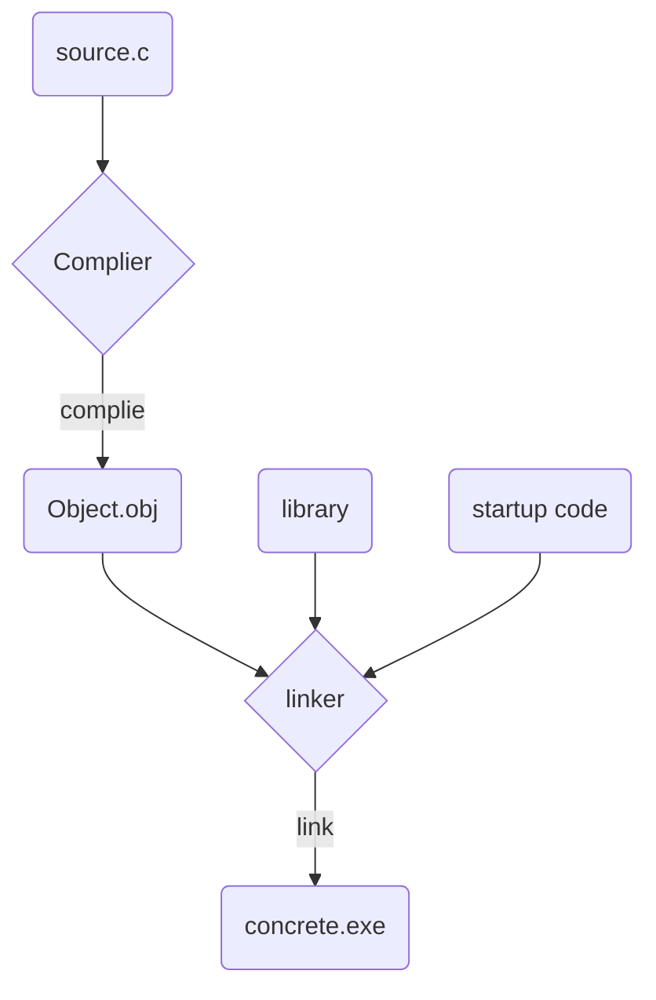
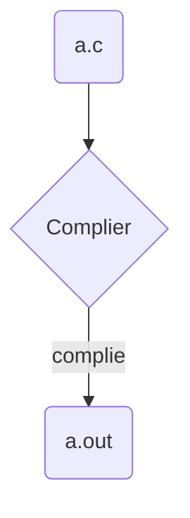

# C language learn notebook（2022-01-02）
## 1. 介绍
### 1.1 C语言标准
>C90   
>C99  
> C11

***
### 1.2 How to use C language
1.定义程序的目标  
2.设计程序  
3.编写代码  
4.编译  
5.运行程序 
6.测试和调试程序  
7.维护和修改代码

***
### 1.3.1 目标代码，可执行文件和库

### 1.3.2 UNIX

